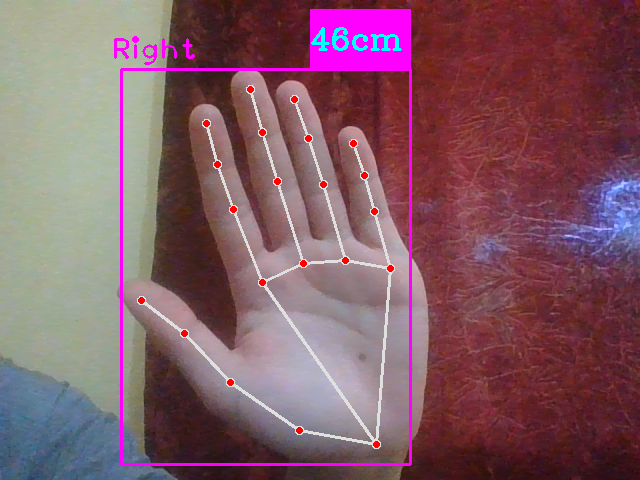

# Hand-Distance-Measurement
# Hand Distance Measurement with Mediapipe

This Python project uses the Mediapipe library to measure the distance between two specific landmarks on a hand using a webcam or the default camera. It provides real-time hand landmark detection and displays the calculated distance in centimeters on the video stream.

## Table of Contents
- [Introduction](#introduction)
- [Features](#features)
- [Features](#MyProject)
- [Installation](#installation)
- [Usage](#usage)
- [Contributing](#contributing)
- [License](#license)

## Introduction

The Hand Distance Measurement project uses Google's Mediapipe library to accurately detect hand landmarks and compute the distance between the tip of the thumb and the tip of the index finger. The distance is then converted into centimeters using a pre-calibrated polynomial regression model. The application provides a user-friendly interface to visualize the hand landmarks and the computed distance in real-time, making it useful for various applications, including interactive virtual environments and gesture-based control systems.

## Features

- Real-time hand landmark detection using the powerful Mediapipe framework.
- Precise calculation of the distance between two specific hand landmarks.
- Visualization of the hand landmarks and bounding box on the video stream.
- Interactive display of the computed distance in centimeters on the video feed.
- Capability to capture images of the video frames for analysis or documentation.
## My Project
 This is a description of my awesome project!

 
 

  

## Installation

1. Clone the repository to your local machine:
2. Install the required packages using pip:
## Usage

1. Run the Python script:
2. A window will open displaying the webcam feed with real-time hand landmark detection. Place your hand in front of the camera to see the computed distance between the thumb and the index finger in centimeters.
3. Press the 'q' key to exit the application.

## Contributing

Contributions are welcome! If you have any ideas, bug fixes, or improvements, please feel free to submit a pull request or open an issue.

## License

This project is licensed under the [MIT License](LICENSE). You can freely use and modify the code, subject to the terms of the license agreement.

